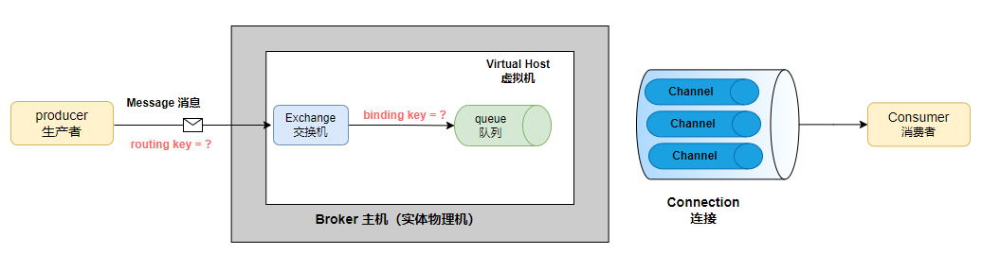
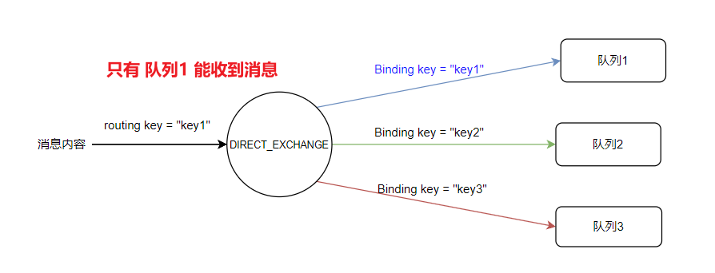
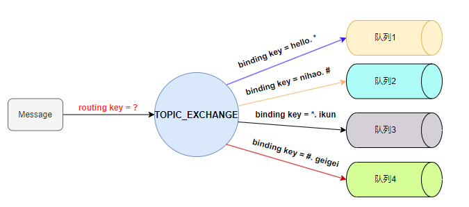
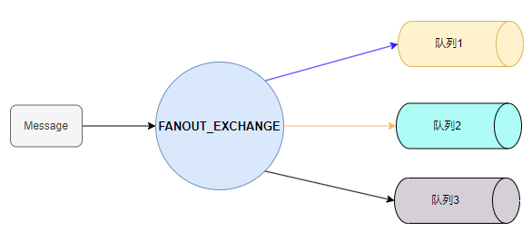

#  spring-boot3-integration-learning 

## 1. 集成 `elasticsearch` 🔍
* ES索引的keyword类型和text类型以及termQuery,match,match_phrase区别
> 

* easy-es 文档地址： [点击访问](https://www.easy-es.cn/pages/e8b9ad/#%E5%89%8D%E7%BD%AE%E9%85%8D%E7%BD%AE)

## 2. 集成消息队列
### 2.1 集成 ActiveMQ
### 2.2 集成 RabbitMQ
####  rabbitmq 工作模型  

* **图例名词说明**

  | 名词         | 解释说明                                                     |
  | ------------ | ------------------------------------------------------------ |
  | Broker       | RabbitMQ 的核心服务实体，是消息队列服务器的实例。它负责接收、存储和转发消息 |
  | Virtual Host | Broker 下的一个**逻辑分区**，用于隔离不同的应用、环境或租户。每个 Virtual Host 是一个独立的命名空间，拥有自己的交换机、队列、绑定、用户权限等资源 |
  | Exchange     | 消息交换机。指定消息按照何种规则路由到哪个队列Queue。        |
  | Queue        | 消息队列，消息的载体，每条消息都会被投送到一个或多个队列中   |
  | Routing Key  | 路由关键字。Exchange根据Routing Key进行消息投递。定义绑定时指定的关键字称为 Binding Key |
  | Binding Key  | 绑定关键字。作用就是将Exchange和Queue按照某种路由规则绑定起来 |
  | Connection   | Producer 和 Consumer 与Broker之间的TCP长连接。               |
  | Channel      | 消息通道，也称信道。在客户端的每个连接里可以建立多个Channel，每个Channel代表一个会话任务。 |
  | Poducer      | 消息生产者。主要负责将消息投递到对应的Exchange上面           |
  | Consumer     | 消息消费者。消息的接收者，处理生产者发来的消息。             |

####  交换机类型  
* **Direct Exchange** 直连交换机
  > 定义：直连类型的交换机与一个队列绑定时，需要指定一个明确的binding key
  > 路由规则：发送消息到直连类型的交换机时，只有**routing key**与**binding key**完全匹配时，绑定的队列才能收到消息。
  例如：
  > 
* **Topic Exchange** 主题交换机
  
  > 定义：主题类型的交换机与一个队列绑定时，可以指定按模式匹配的routing key；
  >
  > 通配符：* 代表匹配一个单词,  # 代表匹配零个或者多个单词, 单词与单词之间用 `.`  隔开。
  >
  > 路由规则：发送消息到主题类型的交换机时，**routing key** 符合 **binding key** 的模式时，绑定的队列才能收到消息。
  >
  > 
  >
  > * 当 routing key= `hello.world` , 只有 队列1  能收到消息
  > * 当  routing key= `nihao.ikun` , 只有 队列2 、 队列3   能收到消息
  > * 当  routing key= `we.love.geigei`，只有 队列4  能收到消息

* **Fanout Exchange** 广播交换机

  > 定义：**Fanout Exchange（广播交换机）** 是一种 **发布/订阅（Publish/Subscribe）** 类型的交换机。
  >
  > 路由规则：它将消息 **无差别地广播给所有绑定到该 Exchange 的队列**。
  >
  > 